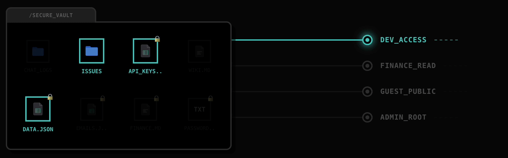

# puppyone

<a href="https://www.puppyone.ai" target="_blank">
  
</a>
&nbsp;
<a href="https://doc.puppyagent.com" target="_blank">
  
</a>
&nbsp;
<a href="https://x.com/puppyone_ai" target="_blank">
  
</a>
&nbsp;
<a href="https://discord.gg/eRjwqZpjBT" target="_blank">
  
</a>

> **The File System for Agent Context.**


**PuppyOne is the file-based context infrastructure for AI agents. Connect fragmented context, transform raw data into a unified file system, and enable Agents to access all context via Bash and MCP.**

---

## The Magic

Imagine your AI Agent could do this:

```bash
# List your Notion workspace as if it were a directory
$ ls /mnt/context/notion/product-specs
v1-launch-plan.md    user-research.csv    meeting-notes/

# Read a GitHub issue directly as a file
$ cat /mnt/context/github/issues/102.json
{
  "title": "Bug in login flow",
  "status": "open",
  "body": "..."
}

# Search across EVERYTHING with standard grep/find tools
$ grep -r "API Key" /mnt/context/
```

## Supported Sources

**Connect Notion, GitHub, Airtable, Google Drive, and local files.** We turn your scattered SaaS silos into a unified file tree.


## File Level Security (FLS)

**Think of it as Row Level Security (RLS), but for Agent context.**

PuppyOne enforces strict isolation by dynamically mounting only authorized files into the Agent's sandbox. **If an Agent doesn't have permission, the file physically doesn't exist in its environment.**



## Quick Start

### 1. Cloud (Hosted) — No Setup

Create an account at [puppyone.ai](https://www.puppyone.ai) and mount your first data source in minutes.

### 2. Self-Hosted (Local)

Run the backend locally using Docker or Python.

See docs for detailed steps:
- [Getting Started](docs/getting-started.md)
- [Configuration](docs/configuration.md)
- [Docker Compose](docs/deployment/docker-compose.md)

---


## Architecture

We bridge the gap between SaaS APIs and File System calls.

```
┌──────────┐  ┌──────────┐  ┌──────────┐  ┌──────────┐
│  Notion  │  │  GitHub  │  │ Airtable │  │  Files   │
└─────┬────┘  └─────┬────┘  └─────┬────┘  └─────┬────┘
      │             │             │             │
      └─────────────▼─────────────▼─────────────┘
                    │
            ╔═══════▼═══════╗
            ║   puppyone    ║  ◄── Virtual File System Layer
            ║  Files / JSON ║      (The "Mount" Point)
            ╚═══════▲═══════╝
                    │
      ┌─────────────┼─────────────┐
      │             │             │
  ┌───▼───┐     ┌───▼───┐     ┌───▼───┐
  │  MCP  │     │  API  │     │Sandbox│
  └───┬───┘     └───┬───┘     └───┬───┘
      │             │             │
┌─────▼────┐  ┌─────▼────┐  ┌─────▼────┐
│ Cursor   │  │ Python   │  │ E2B      │
│ Claude   │  │ Scripts  │  │ Agents   │
└──────────┘  └──────────┘  └──────────┘
```

---

## Contributing

- Issues and feature requests are welcome.
- Please open a PR for small fixes; for larger changes, file an issue first to discuss the design.

---

## License

This repository uses the Puppyone Sustainable Use License (SUL).

Summary (for convenience; the License controls):
1. Personal use (individual): Allowed, free.
2. Internal business use (single-tenant, per organization): Allowed, free.
3. Self-hosted multi-tenant: Not allowed.
4. Commercial redistribution: Not allowed.

See `LICENSE` for full terms.
