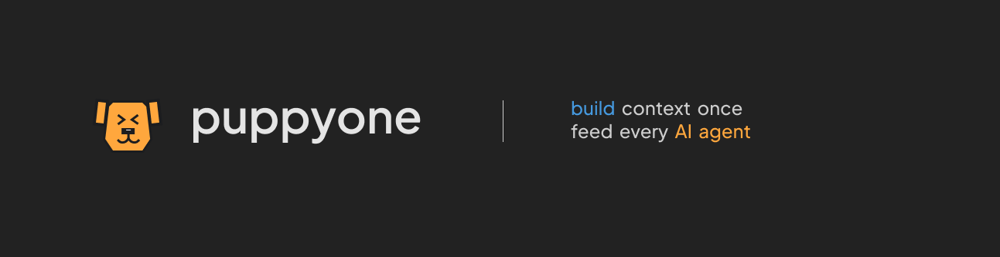

# puppyone

<a href="https://www.puppyone.ai" target="_blank">
  
</a>
&nbsp;
<a href="https://doc.puppyagent.com" target="_blank">
  
</a>
&nbsp;
<a href="https://x.com/puppyone_ai" target="_blank">
  
</a>
&nbsp;
<a href="https://discord.gg/eRjwqZpjBT" target="_blank">
  
</a>
&nbsp;
<a href="mailto:guantum@puppyagent.com">
  
</a>

**puppyone** is the **Context Base for AI Agents.**

A **centralized, structured, and scalable** context platform. Unify your scattered data from Notion, GitHub, Airtable, and local files into one central, multi-agent collaborative, extensible context base. Connect any Agent to this single source of truth—one integration, all your context.

---

## What Problems Does It Solve?

**1. Data is too scattered — Agents can't get complete context**

Your data is spread across 30+ places: product docs in Notion, code in GitHub, customer info in Airtable, pricing in Google Sheets, and PDFs on your local drive. Every time you want an Agent to use this data, you have to integrate it all over again.

**2. Different Agents need different permissions — configuration is tedious**

Support Agents should only read product catalogs, not modify prices. Dev Agents can edit requirement docs. Sales Agents can view quotes but can't delete customer info. You need fine-grained, centralized permission control—not "all-or-nothing".

**3. Every Agent connects differently — high maintenance cost**

Cursor needs MCP, backend scripts need REST API, real-time scenarios need SSE. Each integration pattern needs unified logging and monitoring: which context was accessed, what was the query, when did it happen, success or failure.

---

## How puppyone Solves This

We reduce all problems to one thing: **Give Agents a unified context base they can understand.**

### 1. A Cloud Folder

No matter where your data comes from—Notion, GitHub, Airtable, or local PDFs—once connected to puppyone, it all becomes files in this folder. Notion pages become Markdown, GitHub repos become code directories, Airtable tables become structured documents. For Agents, the world has just one folder, not 30 SaaS tools.

### 2. A Sandbox for Each Agent

Like managing local folders, you can set boundaries for each Agent: Support Agent can only read `/product-docs`, can't see `/financials`; Dev Agent can write to `/requirements`; Sales Agent can view quotes but can't delete. Agents can not only "read" these files but also use Bash commands and code in the sandbox—all actions isolated, no leaks, no boundary violations.

### 3. Unified Monitoring

Whether your Agent connects via MCP (Cursor), REST API (backend scripts), or sandbox automation—all requests go through one interface, all operations have unified logs. Which Agent accessed which file, when, what query, success or failure—all visible at a glance.

---

## Architecture

```
┌──────────┐  ┌──────────┐  ┌──────────┐  ┌──────────┐
│  Notion  │  │  GitHub  │  │ Airtable │  │  Files   │
└─────┬────┘  └─────┬────┘  └─────┬────┘  └─────┬────┘
      │             │             │             │
      └─────────────▼─────────────▼─────────────┘
                    │
            ╔═══════▼═══════╗
            ║   puppyone    ║  ◄── Context Base (Cloud Folder)
            ║  Files / JSON ║
            ╚═══════▲═══════╝
                    │
      ┌─────────────┼─────────────┐
      │             │             │
  ┌───▼───┐     ┌───▼───┐     ┌───▼───┐
  │  MCP  │     │  API  │     │Publish│
  └───┬───┘     └───┬───┘     └───┬───┘
      │             │             │
┌─────▼────┐  ┌─────▼────┐  ┌─────▼────┐
│ Cursor   │  │ Custom   │  │ Public   │
│ Claude   │  │ Agent    │  │ Link     │
└──────────┘  └──────────┘  └──────────┘
```

---

## Typical Use Cases

| Use Case | Data Sources | Agent Permissions |
|----------|--------------|-------------------|
| **Support Agent** | Product catalog + FAQ | Read-only |
| **Dev Agent** | Requirements docs + Code knowledge base | Read & Write |
| **Sales Agent** | Pricing sheets + CRM data | Read-only |

---

## Quick Start

```
1. Import Data    →  Connect Notion / GitHub / Upload files
2. Set Permissions →  Choose which Tools and paths the Agent can access
3. Connect Agent   →  Copy MCP config to Cursor, or use API
```

### Cloud (Hosted) — No Setup

Create an account at [puppyone.ai](https://www.puppyone.ai) and get started in minutes.

### Self-Hosted (Local) — For Developers

See docs for detailed steps:
- [Getting Started](docs/getting-started.md)
- [Configuration](docs/configuration.md)
- [Docker Compose](docs/deployment/docker-compose.md)

---

## Core Concepts

```
Workspace (your account)
└── Project (a context namespace, e.g., "Product Knowledge Base")
    └── Table (a structured JSON document)
        └── JSON Data (your actual content)
```

| Concept | Description |
|---------|-------------|
| **Project** | Top-level container for organizing context by business scenario |
| **Table** | A structured JSON document with automatic version history |
| **Tool** | Operations Agents can perform: `query_data`, `create`, `update`, `delete` |
| **MCP** | Model Context Protocol — how Cursor/Claude access your data |
| **Connector** | Integrations for Notion, GitHub, Airtable, Google Sheets, file upload, URL crawl |
| **API Key** | Credential with specific permissions scoped to each Agent |

---

## Contributing

- Issues and feature requests are welcome
- Please open a PR for small fixes; for larger changes, file an issue first to discuss the design
- By contributing, you agree your contributions may be used under the project's license

---

## License

This repository uses the Puppyone Sustainable Use License (SUL).

Summary (for convenience; the License controls):
1. Personal use (individual): Allowed, free.
2. Internal business use (single-tenant, per organization): Allowed, free.
3. Self-hosted multi-tenant: Not allowed. To obtain rights, contact guantum@puppyagent.com.
4. Managed/hosted service to third parties: Not allowed. Subscribe to the official hosted service at https://www.puppyone.ai or obtain a commercial license.
5. Commercial redistribution (paid distribution): Not allowed. Commercial license required.
6. Use of Puppyone trademarks/logos: Not granted; prior written permission required.

See `LICENSE` for full terms.
