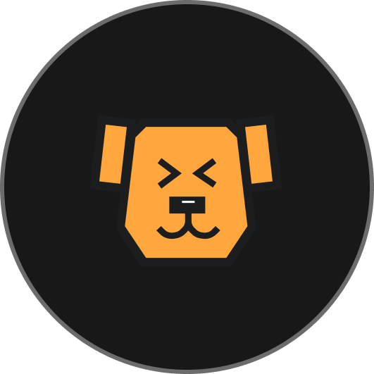

<p align="center">
  
</p>

<h1 align="center">PuppyAgent</h1>


<p align="center">
  <a href="https://www.puppyagent.com" target="_blank">
    
  </a>
  &nbsp;
  <a href="https://doc.puppyagent.com" target="_blank">
    
  </a>
   &nbsp;
    <a href="https://x.com/PuppyAgentTech" target="_blank">
    
  </a>
  &nbsp;
  <a href="https://discord.gg/eRjwqZpjBT" target="_blank">
    
  </a>
  &nbsp;
  <a href="mailto:guantum@puppyagent.com">
    
  </a>
</p>

<p align="center">Automate your knowledge bases with agents</p>

## What is PuppyAgent

PuppyAgent is a context‑centric workspace where agents connect contexts to automate your knowledge bases.


## Why PuppyAgent

- **Context‑centric**: not flow orchestration; context is the interface, users face results
- **Agent‑friendly**: agent‑oriented indexing, not a static knowledge base or database
- **Workflow as edge**: workflows are edges between contexts; beyond orchestration, they embody agents
- **RAG & Deep Research**: on local knowledge; supporting data cleaning, structuring, indexing


Common use cases:

- Deep Research and document Q&A (Agentic RAG)
- Content extractio
- Agentive Archive
- Content Generation

## Quick Start

Choose ONE (alternatives—pick just one):
- **Cloud (Hosted by PuppyAgent)**: zero setup, managed upgrades/scaling, support.
- **Self-Hosted (Local)**: runs fully on your machine; data stays local; best for prototyping/dev.


### Cloud (Hosted by PuppyAgent) — no setup

   Create an account at https://www.puppyagent.com and get started.

### Self-Hosted (Local) — for developers

Prereqs: Python 3.10+, Node.js 18+, npm

Option A) One-click start (recommended)
```bash
./scripts/run-all.sh
```

This script will:
- Create virtualenvs and install Python deps for `PuppyStorage` and `PuppyEngine`
- Install frontend deps for `PuppyFlow`
- Launch services on: Storage 8002, Engine 8001, Flow 4000

Option B) Manual start
```bash
# 1) Storage
cd PuppyStorage
python3 -m venv .venv && source .venv/bin/activate
pip install -r requirements.txt
python -m server.storage_server

# 2) Engine
cd ../PuppyEngine
python3 -m venv .venv && source .venv/bin/activate
pip install -r requirements.txt
python -m Server.EngineServer

# 3) Frontend
cd ../PuppyFlow
npm install
npm run dev
```

Once all three are running, open http://localhost:4000


## Core Concepts

- Workspace: your project context (workflows, assets, settings)
- Block: an operation (e.g., load file, embed, query, call model)
- Edge: a connection that passes data between blocks
- Workflow: a graph of blocks and edges that runs as a job
- Storage: where files, chunks, and vectors are managed


## Key Features

- Visual editor for workflows (drag, connect, configure)
- Blocks for file operations, LLM calls, embeddings, search, control-flow
- Pluggable vector databases (Milvus, Qdrant, Chroma, Pinecone, Weaviate, Postgres+Vecs)
- Streaming results and structured outputs
- Local-first setup; ready to scale in production environments


## Contributing

- Issues and feature requests are welcome
- Please open a PR for small fixes; for larger changes, file an issue first to discuss the design
- By contributing, you agree your contributions may be used under the project’s license


## License

This repository uses the PuppyAgent Sustainable Use License (SUL).

Summary (for convenience; the License controls):
1) Personal use (individual): Allowed, free.
2) Internal business use (single-tenant, per organization): Allowed, free.
3) Self-hosted multi-tenant: Not allowed. To obtain rights, contact guantum@puppyagent.com.
4) Managed/hosted service to third parties: Not allowed. Subscribe to the official hosted service at https://wwww.puppyagent.com or obtain a commercial license.
5) Commercial redistribution (paid distribution): Not allowed. Commercial license required.
6) Use of PuppyAgent trademarks/logos: Not granted; prior written permission required.

See `LICENSE` for full terms.
