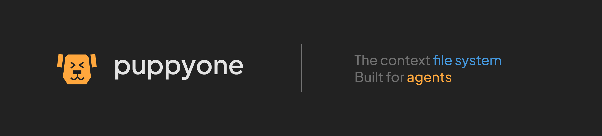
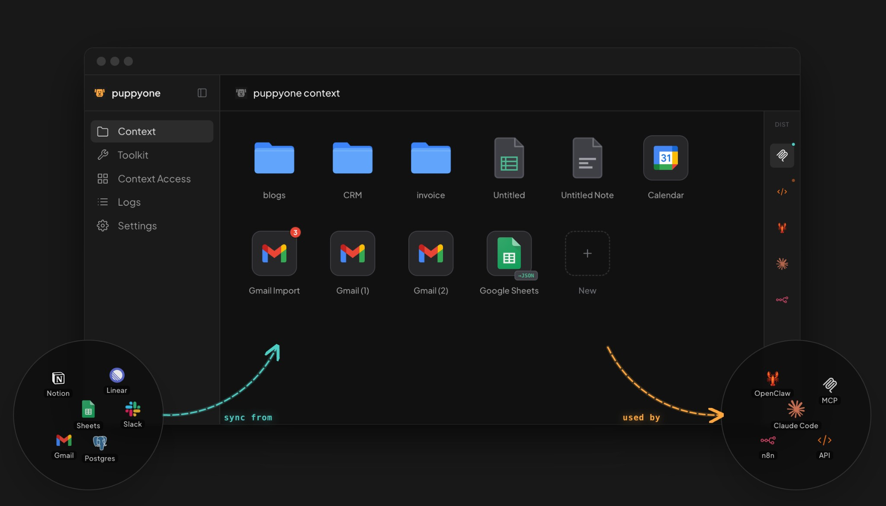
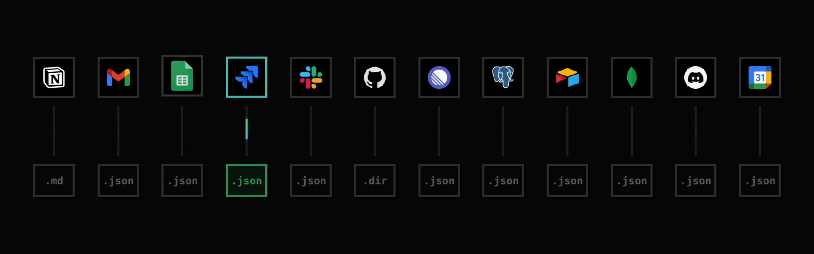
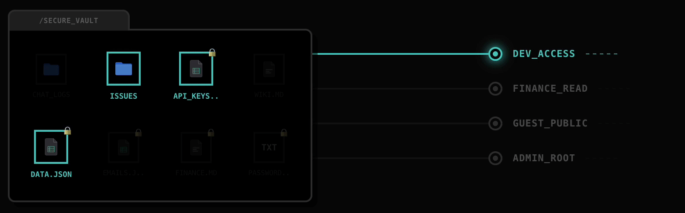

<p align="center">
  
</p>

<p align="center">
  <b>The context file system for agents.</b><br>
  With agent-level auth, versioning, and collaboration.
</p>

<p align="center">
  <a href="https://www.puppyone.ai" target="_blank">
    
  </a>
  &nbsp;
  <a href="https://www.puppyone.ai/doc" target="_blank">
    
  </a>
  &nbsp;
  <a href="https://x.com/puppyone_ai" target="_blank">
    
  </a>
  &nbsp;
  <a href="https://discord.gg/zwJ9Y3Uvpd" target="_blank">
    
  </a>
</p>

---


## Why agents need a new file system

Most capable agents today are file-based: they read, write, and execute through Bash and local file systems. However, **traditional file systems were never built to be a context infra for agents.**

- **No connectors.** Your data lives in Notion, GitHub, Google Drive, and dozens of other tools. Your agent can't see any of it.
- **No backup and rollback.** A hallucinating agent overwrites a critical file. The previous version is gone.
- **No file-level auth for agents.** Controlling per-agent read/write access with chmod and SSH keys doesn't scale.

## Why PuppyOne? <a href="https://github.com/puppyone-ai/puppyone"></a>

PuppyOne is a context file system built only for agents. It directly solves all of the above:

- **15+ Connectors** — Mount Notion, GitHub, Gmail, Google Drive, Airtable, and more into a single directory tree. All data is transformed into agent-friendly formats (Markdown, JSON, raw files).
- **Versioning & Rollback** — Every write is tracked. Diff any file against its history and rollback to a previous state in one click.
- **File-Level Security (FLS)** — Each agent gets its own view of the file tree based on its identity. Files it shouldn't access physically don't exist in its environment.
- **Multi-Channel Access** — Distribute your context via OpenClaw, MCP, Bash, SSH, REST API, or CLI. Agents access it however they work best.
- **Audit Logs** — Full traceability: which agent read, wrote, or deleted which file, and when.




---

## Connected

Connect context from SaaS tools, databases, and the web into agent-friendly files.

puppyone provides OAuth connectors for **15+ platforms** — including Notion, GitHub, Gmail, Google Drive, Linear, Airtable, Google Sheets, Google Calendar, and more. It also supports URL scraping, database connections, local folder sync, and custom scripts.

All data is transformed into agent-friendly formats (Markdown, JSON, raw files) and stored in your **Context Space** — a cloud file system that any agent can browse like a local directory.



---

## Collaborative

Agent-level auth, versioning, audit, and collaboration — built for agents, not humans.

- **File Level Security (FLS)** — Per-agent file permissions enforced at the filesystem layer. If an agent doesn't have access, the file physically doesn't exist in its environment. Think Row Level Security (RLS), but for files.
- **Version history & rollback** — File-level versioning with diff comparison and one-click rollback. Folder-level snapshots for bulk recovery.
- **Audit logs** — Every read and write operation is recorded: who did what, to which file, and when.
- **Checkout / commit workflow** — Locking, conflict detection, and resolution for concurrent agent edits.



---

## Accessible

One Context Space, many ways in. Your agents access it however they work best:

- **MCP (Model Context Protocol)** — Auto-generated MCP endpoints for each agent. Connect Cursor, Claude Desktop, Windsurf, Cline, or any MCP-compatible client in seconds.
- **Sandbox** — Isolated Docker/E2B containers with only the authorized files mounted. Agents execute code securely without seeing anything they shouldn't.
- **REST API** — Full programmatic access. Read, write, query, and manage everything.
- **CLI** — Every operation available via `puppyone` command line, so AI coding tools like Claude Code can drive the platform directly.
- **Local folder sync** — Real-time bidirectional sync between local directories and the cloud Context Space via the OpenClaw protocol.

---

## Quick Start

### Cloud (Hosted) — No Setup

Create an account at [puppyone.ai](https://www.puppyone.ai) and connect your first data source in minutes.

### Self-Hosted

```bash
git clone https://github.com/puppyone-ai/puppyone.git
cd puppyone/backend
cp .env.example .env   # fill in your credentials
uv sync
uv run uvicorn src.main:app --host 0.0.0.0 --port 9090 --reload
```

See the [documentation](https://www.puppyone.ai/doc) for full setup guides.

---

## Contributing

We welcome issues, feature requests, and pull requests.

- For small fixes, open a PR directly.
- For larger changes, [file an issue](https://github.com/puppyone-ai/puppyone/issues/new/choose) first to discuss the design.

See [CONTRIBUTING.md](CONTRIBUTING.md) for development setup and guidelines.

---

## License

This repository uses the Puppyone Sustainable Use License (SUL).

| Use case | Allowed |
|----------|---------|
| Personal use (individual) | Yes, free |
| Internal business use (single-tenant) | Yes, free |
| Self-hosted multi-tenant | No |
| Commercial redistribution | No |

See [`LICENSE`](LICENSE) for full terms.
