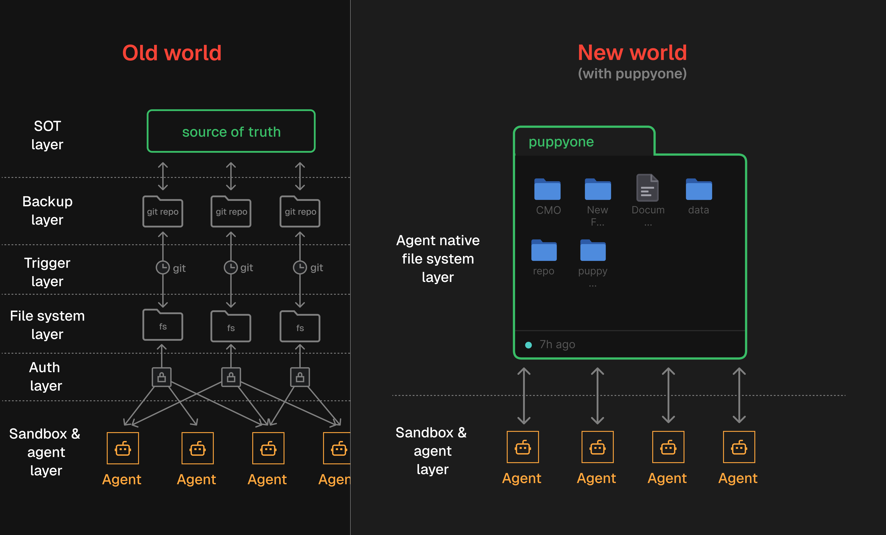

<div align="center">
  
  
  <h1>Puppyone</h1>
  
  <p><b>File system built for AI agents</b></p>
  <p>Puppyone provides the storage infrastructure for your agent harness.<br/>
  Connect, host, govern, backup, version control, and distribute your context.</p>

  <p>
    <a href="https://www.puppyone.ai"></a>
    <a href="https://www.puppyone.ai/doc"></a>
    <a href="https://discord.gg/zwJ9Y3Uvpd"></a>
    <a href="https://x.com/puppyone_ai"></a>
  </p>
</div>

---

## What exactly is Puppyone?

Is Puppyone a runtime or a sandbox? No.  
Is it a vector database for semantic search? No.  

Puppyone is the storage layer in agent harness engineering. 

If your agents' data is structured as files, you need a **puppyone: file system built for AI agents**.

## The Storage Layer of Agent Harness: Old World vs New World

Developers typically store agent context in local file systems backed by Git. But these were built for *humans*, not AI agents. With these problems:



|  | Local File System + Git | Puppyone |
|--|------------------------|----------|
| **Backup** | Relies on agent to `git commit`. Forget once, data is gone. | Every modification auto-snapshotted. One-click rollback. |
| **Permissions** | OS user logins only. All agents share everything, or fully isolated sandboxes with no collaboration. | File Level Security (FLS). Shared context space, per-agent scoped views. |
| **Access Channels** | Local Bash only. Need custom APIs for anything else. | Native MCP, REST API, CLI, Bash, Sandbox out of the box. |
| **Data Sources** | Manual integration for each platform. | 15+ built-in connectors (Notion, GitHub, Drive, etc.) auto-sync as files. |


---

## Get Started

### 1. Install / Deploy

#### Option A: Cloud (Hosted)

The fastest way — no infrastructure to manage.

Create an account at [puppyone.ai](https://www.puppyone.ai).

#### Option B: Self-Hosted (Docker)

Run the full stack locally with Docker. The only prerequisite is [Docker](https://www.docker.com/).

```bash
git clone https://github.com/puppyone-ai/puppyone.git
cd puppyone/docker
cp .env.example .env
docker compose up -d
```

This starts everything — PostgreSQL, Auth, API gateway, Redis, MinIO, backend, and frontend — in a single command. The database schema is applied automatically on first run.

The Docker defaults already separate browser-facing URLs (`localhost`) from container-internal service URLs (`api`, `kong`), so the same setup works for both client-side and Next.js server-side requests.

The backend container also mounts the host Docker socket and a dedicated sandbox temp directory, so agent bash and sandbox endpoints work out of the box in the local Compose stack without changing the backend's global temp directory behavior.

| Service | URL |
|---------|-----|
| Frontend | `http://localhost:3000` |
| Backend API | `http://localhost:9090` |
| Supabase API | `http://localhost:8000` |
| MinIO Console | `http://localhost:9001` |

> **Security note:** The local Docker stack enables Docker-backed sandboxes by sharing the host Docker daemon with the backend container. This is convenient for local self-hosting, but for remote or multi-tenant deployments you should prefer `SANDBOX_TYPE=e2b` with an `E2B_API_KEY`.

The first startup may take 1-2 minutes. Then open `http://localhost:3000`. If the web app is not reachable yet, run `docker compose ps`.

Optional: to enable agent chat in the self-hosted stack, add your `ANTHROPIC_API_KEY` to `docker/.env` and restart:

```bash
cd docker
docker compose up -d
```

Optional: OAuth connectors such as GitHub, Gmail, and Google Drive require provider credentials in `docker/.env` (for example `GITHUB_CLIENT_ID` / `GITHUB_CLIENT_SECRET` and `GOOGLE_CLIENT_ID` / `GOOGLE_CLIENT_SECRET`).

### 2. First Run (for both cloud and self-host)

The product flow is the same for Cloud and self-hosted once the stack is running. Start by opening the web app and signing in:

- Cloud: [puppyone.ai](https://www.puppyone.ai)
- Self-Hosted: `http://localhost:3000`

If you want to manage your workspace from the CLI, install it and sign in:

```bash
npm install -g puppyone
puppyone auth login          # first run asks: Cloud / Local / Custom URL
```

For self-hosted, choose `Local` at the prompt or pass `-u http://localhost:9090`.

The CLI stores sessions per target, so you can switch between Cloud and self-hosted without re-entering credentials (`puppyone auth targets switch <url>`).

**1. Create your first Context Space**

```bash
puppyone init "My Project"
```

This creates a project with starter guides and sets it as active. You can also create your first project directly from the web app.

**2. Add your first content**

Start with something that works immediately in both Cloud and self-hosted:

| Source | Command |
|--------|---------|
| Webpage | `puppyone access add url https://example.com --scope /refs` |
| Local folder | `puppyone access add folder ./my-docs --scope /docs` |

You can also upload files directly from the web app. Use `--folder` to organize synced content into any path in your Context Space.

### 3. Optional: Enable More Features

- **Agent chat** — In self-hosted deployments, add `ANTHROPIC_API_KEY` to `docker/.env` and restart the stack.
- **OAuth connectors** — In self-hosted deployments, configure provider credentials before using GitHub, Gmail, Google Drive, and other OAuth-based connectors.
- **Distribute via MCP** — Create an MCP endpoint when you want agents in Cursor, Claude Desktop, or other MCP clients to read your Context Space:

```bash
puppyone access add mcp "My Context"
# → outputs MCP endpoint URL and API key
```

See the [full connector guide](https://www.puppyone.ai/doc) for all 15+ supported platforms and advanced setup details.

---

## Features

### Connected

Connect context from SaaS tools, databases, and the web into agent-friendly files.

Puppyone provides OAuth connectors for **15+ platforms** — including Notion, GitHub, Gmail, Google Drive, Linear, Airtable, Google Sheets, Google Calendar, and more. It also supports URL scraping, database connections, local folder sync, and custom scripts.

All data is transformed into agent-friendly formats (Markdown, JSON, raw files) and stored in your **Context Space** — a cloud file system that any agent can browse like a local directory.


### Collaborative

Agent-level auth, versioning, audit, and collaboration — built for agents, not humans.

- **File Level Security (FLS)** — Per-agent file permissions enforced at the filesystem layer. If an agent doesn't have access, the file physically doesn't exist in its environment. Think Row Level Security (RLS), but for files.
- **Version history & rollback** — File-level versioning with diff comparison and one-click rollback. Folder-level snapshots for bulk recovery.
- **Audit logs** — Every read and write operation is recorded: who did what, to which file, and when.
- **Checkout / commit workflow** — Locking, conflict detection, and resolution for concurrent agent edits.


### Accessible

One Context Space, many ways in. Your agents access it however they work best:

- **MCP (Model Context Protocol)** — Auto-generated MCP endpoints for each agent. Connect Cursor, Claude Desktop, Windsurf, Cline, or any MCP-compatible client in seconds.
- **Sandbox** — Isolated Docker/E2B containers with only the authorized files mounted. Agents execute code securely without seeing anything they shouldn't.
- **REST API** — Full programmatic access. Read, write, query, and manage everything.
- **CLI** — Every operation available via `puppyone` command line, so AI coding tools like Claude Code can drive the platform directly.
- **Local folder sync** — Real-time bidirectional sync between local directories and the cloud Context Space via the OpenClaw protocol.

---

## Tech Stack

| Layer | Technology |
|-------|-----------|
| Backend | [Python 3.12+](https://www.python.org/) / [FastAPI](https://fastapi.tiangolo.com/) |
| Frontend | [Next.js 15](https://nextjs.org/) / React 18 / TypeScript / Tailwind CSS |
| CLI | Node.js / [Commander.js](https://github.com/tj/commander.js) |
| Database | [Supabase](https://supabase.com/) (PostgreSQL) |
| Auth | Supabase Auth (JWT + Access Key) |
| Storage | AWS S3 / MinIO / LocalStack |
| Task Queue | [ARQ](https://github.com/samuelcolvin/arq) (Redis) |
| Sandbox | Docker / [E2B](https://e2b.dev/) |

---

## Contributing

We welcome issues, feature requests, and pull requests.

- For small fixes, open a PR directly.
- For larger changes, [file an issue](https://github.com/puppyone-ai/puppyone/issues/new/choose) first to discuss the design.

See [CONTRIBUTING.md](CONTRIBUTING.md) for development setup and guidelines.

---

## License

Puppyone is open source under the [Apache License 2.0](LICENSE).

You can use, modify, and distribute Puppyone freely — for personal projects,
internal company tools, self-hosted deployments (single- or multi-tenant),
commercial products, and managed services — subject to the standard Apache 2.0
terms (preserve copyright and `NOTICE`, document significant modifications, and
note that no trademark rights are granted).

See [`LICENSE`](LICENSE) for the full license text and [`NOTICE`](NOTICE) for
attribution of bundled third-party components.

> **Trademarks.** "Puppyone", "PuppyOne", and the Puppyone logo are trademarks
> of PuppyOne authors and are **not** licensed under Apache 2.0. If you fork or
> redistribute, please use a different name and logo for your distribution.

> **Hosted service.** [puppyone.ai](https://www.puppyone.ai) is the official
> managed offering operated by the PuppyOne team. The hosted service is governed
> by its own Terms of Service.
