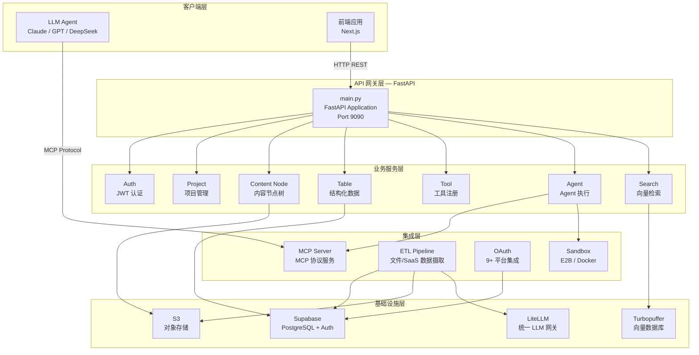

# ContextBase Backend

**可托管的上下文配置与导出平台** — 为 LLM Agent 提供结构化上下文管理、MCP 协议集成和智能数据处理管道。

## 目录

- [架构概览](#架构概览)
- [技术栈](#技术栈)
- [项目结构](#项目结构)
- [快速开始](#快速开始)
- [环境变量](#环境变量)
- [API 文档](#api-文档)
- [核心模块](#核心模块)
- [部署](#部署)
- [测试](#测试)
- [日志](#日志)

## 架构概览



## 技术栈

| 分类 | 技术 |
|------|------|
| 语言 | Python 3.12+ |
| Web 框架 | FastAPI + Uvicorn (ASGI) |
| 包管理 | uv |
| 数据库 | Supabase (PostgreSQL) |
| 对象存储 | AWS S3 / LocalStack (本地) |
| 向量搜索 | Turbopuffer |
| LLM 网关 | LiteLLM (多模型统一接口) |
| 任务队列 | ARQ (基于 Redis 的异步队列) |
| 定时任务 | APScheduler |
| 认证 | JWT (Supabase Auth) |
| 日志 | Loguru (JSON 格式) |
| 部署 | Railway (Nixpacks) |

## 项目结构

```
backend/
├── src/                          # 主源码目录
│   ├── main.py                   # 应用入口 & 生命周期管理
│   ├── config.py                 # 全局配置 (Pydantic Settings)
│   ├── exceptions.py             # 自定义异常
│   ├── exception_handler.py      # 异常处理器
│   │
│   ├── auth/                     # 认证模块 (JWT)
│   ├── project/                  # 项目管理 CRUD
│   ├── content_node/             # 内容节点树 (文件夹/JSON/Markdown/文件)
│   ├── table/                    # 结构化数据表 (JSON Pointer 操作)
│   ├── tool/                     # 工具注册 & 搜索工具索引
│   ├── agent/                    # Agent 聊天 (SSE 流式) & 配置
│   │   └── config/               # Agent 配置管理
│   │
│   ├── mcp_v3/                   # MCP 协议 v3 (工具绑定/代理)
│   ├── mcp/                      # MCP 实例管理 (健康检查)
│   │
│   ├── ingest/                   # 数据摄取 (ETL)
│   │   ├── file/                 # 文件摄取 (MineRU + LLM 清洗)
│   │   └── saas/                 # SaaS 平台同步 (Notion/GitHub 等)
│   │
│   ├── search/                   # 向量搜索 (Turbopuffer + RRF 混合检索)
│   ├── chunking/                 # 文本分块
│   ├── llm/                      # LLM 服务 (生成 + Embedding)
│   ├── turbopuffer/              # Turbopuffer 客户端封装
│   │
│   ├── oauth/                    # OAuth 集成 (Notion/GitHub/Google/Linear/Airtable)
│   ├── s3/                       # S3 存储服务 (上传/下载/分片上传/预签名URL)
│   ├── sandbox/                  # 代码执行沙盒 (E2B / Docker)
│   ├── scheduler/                # 定时任务调度
│   │
│   ├── context_publish/          # 公开 JSON 短链接发布
│   ├── analytics/                # 数据分析
│   ├── profile/                  # 用户画像
│   ├── internal/                 # 内部服务 API
│   │
│   ├── supabase/                 # Supabase 客户端 & Repository
│   └── utils/                    # 工具库 (日志/中间件/通用函数)
│
├── mcp_service/                  # MCP Server 独立服务 (FastMCP)
├── sql/                          # 数据库 Schema (DDL)
├── tests/                        # 测试套件
├── scripts/                      # 工具脚本
├── docs/                         # 功能文档
├── openspec/                     # OpenSpec 变更规范
├── pyproject.toml                # 依赖 & 项目配置
├── railway.toml                  # Railway 部署配置
└── .env.example                  # 环境变量模板
```

## 快速开始

### 前置要求

- Python 3.12+
- [uv](https://github.com/astral-sh/uv) (Python 包管理器)
- Supabase 项目 (数据库 + Auth)
- S3 兼容存储 (生产环境) 或 [LocalStack](https://docs.localstack.cloud/) (本地开发)

### 1. 安装依赖

```bash
cd backend
uv sync
```

### 2. 配置环境变量

```bash
cp .env.example .env
# 编辑 .env 填入你的密钥
```

### 3. 配置本地 S3 (可选，使用 LocalStack)

```bash
# 安装并启动 LocalStack
localstack start

# 安装 AWS CLI 本地版
pip install awscli-local[ver1]

# 创建 S3 Bucket
awslocal s3api create-bucket --bucket contextbase
```

### 4. 启动服务

```bash
uv run uvicorn src.main:app --host 0.0.0.0 --port 9090 --reload --log-level info --no-access-log
```

启动后访问:
- API 文档 (Swagger): http://localhost:9090/docs
- API 文档 (ReDoc): http://localhost:9090/redoc
- 健康检查: http://localhost:9090/health

## 环境变量

核心环境变量说明（完整模板见 `.env.example`）：

| 变量 | 说明 | 必填 |
|------|------|------|
| `SUPABASE_URL` | Supabase 项目 URL | ✅ |
| `SUPABASE_KEY` | Supabase API Key | ✅ |
| `JWT_SECRET` | JWT 签名密钥 | ✅ |
| `S3_ENDPOINT_URL` | S3 端点 (LocalStack: `http://localhost:4566`) | ✅ |
| `S3_BUCKET_NAME` | S3 Bucket 名称 | ✅ |
| `S3_ACCESS_KEY_ID` | S3 Access Key | ✅ |
| `S3_SECRET_ACCESS_KEY` | S3 Secret Key | ✅ |
| `MCP_SERVER_URL` | MCP Server 服务地址 | ✅ |
| `INTERNAL_API_SECRET` | 内部服务通信密钥 | ✅ |
| `OPENROUTER_API_KEY` | OpenRouter LLM 网关 Key | 按需 |
| `ANTHROPIC_API_KEY` | Anthropic API Key | 按需 |
| `E2B_API_KEY` | E2B 沙盒 Key | 按需 |
| `MINERU_API_KEY` | MineRU 文档解析 Key | ETL 启用时 |
| `FIRECRAWL_API_KEY` | Firecrawl 网页抓取 Key | SaaS 摄取时 |
| `ENABLE_ETL` | 是否启用 ETL 管道 (`true`/`false`) | 否 |
| `SKIP_AUTH` | 跳过认证 (仅测试) | 否 |

**OAuth 配置** (每个平台需要 `CLIENT_ID` + `CLIENT_SECRET` + `REDIRECT_URI`):

Notion / GitHub / Google (Sheets, Gmail, Drive, Calendar, Docs) / Linear / Airtable

## API 文档

所有业务 API 统一前缀 `/api/v1`，主要模块：

### 项目 & 内容管理

| 端点 | 说明 |
|------|------|
| `GET/POST/PUT/DELETE /api/v1/projects` | 项目 CRUD |
| `GET/POST/PUT/DELETE /api/v1/nodes` | 内容节点管理 (文件夹/JSON/Markdown/文件) |
| `GET/POST/PUT/DELETE /api/v1/tables` | 数据表 CRUD & JSON Pointer 数据操作 |
| `GET/POST/PUT/DELETE /api/v1/tools` | 工具注册 & 搜索工具索引 |

### Agent & MCP

| 端点 | 说明 |
|------|------|
| `POST /api/v1/agents` | Agent SSE 流式对话 |
| `GET/POST/PUT/DELETE /api/v1/agents/config` | Agent 配置管理 |
| `GET/POST/PUT/DELETE /api/v1/mcp/agents/{id}/tools` | MCP 工具绑定管理 |
| `* /api/v1/mcp/proxy/{api_key}/{path}` | MCP Server 代理 |

### 数据摄取

| 端点 | 说明 |
|------|------|
| `POST /api/v1/ingest/submit/file` | 提交文件摄取任务 (raw / ocr_parse) |
| `POST /api/v1/ingest/submit/saas` | 提交 SaaS/URL 摄取任务 |
| `GET /api/v1/ingest/tasks/{id}` | 查询任务状态 |
| `GET/POST/DELETE /api/v1/ingest/rules` | ETL 规则管理 |

### 存储 & 发布

| 端点 | 说明 |
|------|------|
| `POST /api/v1/s3/upload` | 文件上传 (支持批量/分片) |
| `GET /api/v1/s3/download/{key}` | 文件下载 |
| `POST /api/v1/s3/presigned-url/*` | 预签名 URL |
| `POST /api/v1/publishes` | 创建公开 JSON 短链接 |
| `GET /p/{key}` | 公开只读访问 (无需认证) |

### OAuth & 其他

| 端点 | 说明 |
|------|------|
| `GET /api/v1/oauth/{provider}/authorize` | OAuth 授权 |
| `GET /api/v1/oauth/{provider}/callback` | OAuth 回调 |
| `GET /health` | 健康检查 |
| `POST /internal/*` | 内部服务 API |

> 完整 API 文档请启动服务后访问 `/docs` (Swagger UI) 或 `/redoc` (ReDoc)。

## 核心模块

### MCP 协议集成

通过 MCP (Model Context Protocol) 让 LLM Agent 直接访问上下文数据：

- **MCP Server**: 独立 FastMCP 服务 (`mcp_service/`)，通过代理连接主 API
- **工具绑定**: 将 Tool 绑定到 Agent，Agent 通过 MCP 协议获取工具列表
- **API Key 认证**: 每个 Agent 拥有独立 API Key，通过 URL 参数鉴权

```json
{
  "mcpServers": {
    "contextbase": {
      "command": "npx -y mcp-remote <MCP_SERVER_URL>/mcp?api_key=<YOUR_KEY>"
    }
  }
}
```

### ETL 数据管道

将原始文档转换为 LLM 友好的结构化 JSON：

```
文件上传 → S3 存储 → MineRU 文档解析 → LLM 数据清洗 → 结构化 JSON → S3 + 数据库
```

- **文件摄取**: 支持 PDF/DOC/DOCX/PPT/PPTX/PNG/JPG，MineRU 解析 + LLM 清洗
- **SaaS 摄取**: 支持 Notion/GitHub/Google Sheets/Gmail 等平台数据同步
- **URL 摄取**: 通过 Firecrawl 抓取网页内容
- **异步处理**: ARQ 任务队列，独立 Worker 进程

### 向量搜索

基于 Turbopuffer 的混合检索系统：

- **文本分块**: 可配置 chunk size/overlap 的文本分块
- **向量索引**: 异步索引，支持增量更新
- **混合检索**: RRF (Reciprocal Rank Fusion) 融合向量与关键词搜索
- **文件夹搜索**: 支持按文件夹范围限定搜索

### Agent 执行引擎

支持 SSE 流式输出的 Agent 对话：

- **流式响应**: Server-Sent Events 实时推送
- **工具调用**: Agent 可调用绑定的 MCP 工具
- **沙盒执行**: 支持 E2B 云沙盒和本地 Docker 容器
- **定时执行**: 通过 APScheduler 支持 Agent 定时任务

### OAuth 集成

统一的 OAuth 2.0 集成框架，支持 9+ 平台：

Notion / GitHub / Google Sheets / Gmail / Google Drive / Google Calendar / Google Docs / Linear / Airtable

每个平台提供: 授权 → 回调 → 状态查询 → 断开连接 完整流程。

## 部署

### Railway 部署 (推荐)

项目配置为 Railway 多服务部署，共享同一代码库：

| 服务 | SERVICE_ROLE | 说明 |
|------|-------------|------|
| API Server | `api` (默认) | 主 API 服务 |
| File Worker | `file_worker` | 文件 ETL 处理 Worker |
| SaaS Worker | `saas_worker` | SaaS 数据同步 Worker |
| MCP Server | `mcp_server` | MCP 协议服务 |

通过环境变量 `SERVICE_ROLE` 区分服务角色，详见 `railway.toml`。

### 手动部署

```bash
# API 服务
uv run uvicorn src.main:app --host 0.0.0.0 --port 9090 --no-access-log

# File Worker
uv run arq src.ingest.file.jobs.worker.WorkerSettings

# SaaS Worker
uv run arq src.ingest.saas.jobs.worker.WorkerSettings

# MCP Server
uv run uvicorn mcp_service.server:app --host 0.0.0.0 --port 8080 --no-access-log
```

## 测试

```bash
# 运行全部测试
uv run pytest

# 运行单元测试 (排除 e2e)
uv run pytest -m "not e2e"

# 运行端到端测试
uv run pytest -m e2e

# 运行特定模块测试
uv run pytest tests/test_table_api.py -v
```

## 日志

后端使用 **Loguru** 统一日志，拦截 `uvicorn.*` 等标准库日志：

- **控制台**: 本地终端彩色文本，非终端 JSON 格式
- **文件**: JSON 格式，自动滚动 & 保留

可配置环境变量：

| 变量 | 默认值 | 说明 |
|------|--------|------|
| `LOG_LEVEL` | `INFO` | 日志级别 |
| `LOG_DIR` | `./logs` | 日志目录 |
| `LOG_ROTATION` | `100 MB` | 日志文件滚动阈值 |
| `LOG_RETENTION` | `14 days` | 日志保留时间 |
| `LOG_JSON_CONSOLE` | 自动 | 控制台是否 JSON (终端自动检测) |
| `LOG_JSON_FILE` | `1` | 文件是否 JSON |

## License

请参考项目根目录的许可证文件。
