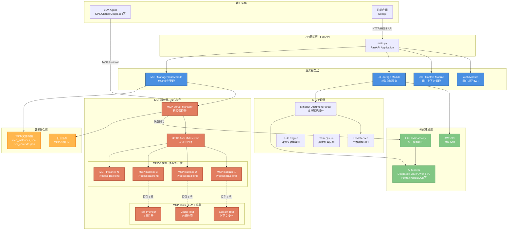

# ContextBase Backend



## Quick start

### Prerequisites

1. **Install uv**

`uv` is a fast Python package manager and project management tool. Please select the installation method according to your operating system:

Please refer to the [uv official documentation](https://github.com/astral-sh/uv) for the installation process.

2. **Download dependencies**

Run the following command in the backend directory to install all dependencies:

```bash
uv sync
```

### Config S3 in local

Install localstack in [localstack](https://docs.localstack.cloud/aws/tutorials/)

Start localstack:
```bash
localstack start
```

Install aws-cli:
```bash
pip install awscli-local[ver1]
```

Create S3 bucket:
```bash
awslocal s3api create-bucket --bucket contextbase
```

List S3 bucket:
```bash
awslocal s3api list-buckets
```

### Configure ETL Service

The ETL module requires MineRU API key and LLM provider API keys to work properly.

Create a `.env` file in the backend directory with the following configuration:

```bash
# MineRU API Configuration (Required for document parsing)
MINERU_API_KEY=your-mineru-api-key

# LLM Provider API Keys (Required for data transformation)
OPENAI_API_KEY=your-openai-api-key
ANTHROPIC_API_KEY=your-anthropic-api-key
DEEPSEEK_API_KEY=your-deepseek-api-key
GOOGLE_API_KEY=your-google-api-key

# ETL Configuration (Optional, defaults shown)
ETL_QUEUE_SIZE=1000
ETL_WORKER_COUNT=3
ETL_TASK_TIMEOUT=600
ETL_CACHE_DIR=.mineru_cache
ETL_RULES_DIR=.etl_rules
```

**获取 MineRU API Key:**
1. 访问 [MineRU官网](https://mineru.net)
2. 注册账号并获取 API Key
3. 每天有 2000 页的高优先级免费额度

### S3 Storage Module

ContextBase 提供了完整的 S3 存储管理模块,支持本地开发(LocalStack)和生产环境(AWS S3)无缝切换。

#### 存储路径结构

所有文件遵循标准化路径结构:

```
/{raw/processed}/{project_id}/{filename}
```

- `raw/`: 存储原始多模态数据(音频、视频、图片、文档等)
- `processed/`: 存储 ETL 转换后的 JSON 数据
- `project_id`: 项目 ID,提供项目级隔离
- `filename`: 原始文件名或 `table_id.json`

**示例:**
- `raw/proj123/document.pdf` - 原始文档
- `processed/proj123/table_users.json` - 处理后的 JSON 数据

#### 配置说明

**本地开发环境 (LocalStack):**

```bash
# .env 配置
S3_ENDPOINT_URL=http://localhost:4566
S3_BUCKET_NAME=contextbase
S3_REGION=us-east-1
S3_ACCESS_KEY_ID=test
S3_SECRET_ACCESS_KEY=test

# 文件大小限制 (字节)
S3_MAX_FILE_SIZE=104857600  # 100MB
S3_MULTIPART_THRESHOLD=104857600  # 100MB
S3_MULTIPART_CHUNKSIZE=5242880  # 5MB
```

**生产环境 (AWS S3):**

```bash
# .env 配置
S3_ENDPOINT_URL=  # 留空使用 AWS 默认
S3_BUCKET_NAME=your-production-bucket
S3_REGION=us-east-1
S3_ACCESS_KEY_ID=your-aws-access-key-id
S3_SECRET_ACCESS_KEY=your-aws-secret-access-key
```

#### API 端点

所有 S3 API 端点都在 `/api/v1/s3` 路径下:

**基础操作:**
- `POST /api/v1/s3/upload` - 单文件上传
- `POST /api/v1/s3/upload/batch` - 批量上传
- `GET /api/v1/s3/download/{key}` - 文件下载
- `HEAD /api/v1/s3/exists/{key}` - 检查文件存在
- `DELETE /api/v1/s3/{key}` - 删除文件
- `POST /api/v1/s3/delete/batch` - 批量删除
- `GET /api/v1/s3/list` - 列出文件
- `GET /api/v1/s3/metadata/{key}` - 获取文件元信息

**预签名 URL:**
- `POST /api/v1/s3/presigned-url/upload` - 生成上传预签名 URL
- `POST /api/v1/s3/presigned-url/download` - 生成下载预签名 URL

**分片上传 (大文件):**
- `POST /api/v1/s3/multipart/create` - 创建分片上传
- `PUT /api/v1/s3/multipart/upload-part` - 上传单个分片
- `POST /api/v1/s3/multipart/complete` - 完成分片上传
- `DELETE /api/v1/s3/multipart/abort` - 取消分片上传
- `GET /api/v1/s3/multipart/list` - 列出进行中的分片上传
- `GET /api/v1/s3/multipart/list-parts` - 列出已上传的分片

#### 分片上传使用方式

对于大文件(>100MB),系统支持分片上传以提高可靠性:

1. **创建分片上传会话:**
```bash
curl -X POST http://localhost:9090/api/v1/s3/multipart/create \
  -H "Content-Type: application/json" \
  -d '{"key": "raw/proj123/large-file.mp4", "content_type": "video/mp4"}'
```

2. **上传分片:**
```bash
curl -X PUT http://localhost:9090/api/v1/s3/multipart/upload-part \
  -F "key=raw/proj123/large-file.mp4" \
  -F "upload_id=<upload_id>" \
  -F "part_number=1" \
  -F "file=@part1.bin"
```

3. **完成上传:**
```bash
curl -X POST http://localhost:9090/api/v1/s3/multipart/complete \
  -F "key=raw/proj123/large-file.mp4" \
  -F "upload_id=<upload_id>" \
  -F 'parts_json=[{"part_number":1,"etag":"..."}]'
```

查看 `/docs` 获取完整的 API 文档和交互式测试界面。

### ETL Pipeline Module

ContextBase 提供了强大的 ETL 管道模块,用于将原始文档转换为结构化 JSON 数据,为 LLM 提供友好的数据访问接口。

#### 工作流程

```
用户上传文件 (via S3 API)
    ↓
存储到 S3: /users/{user_id}/raw/{project_id}/{filename}
    ↓
用户发起 ETL 请求 (提供 JSON Schema 和可选 system_prompt)
    ↓
ETL 服务从 S3 获取文件的预签名 URL
    ↓
调用 MineRU API 创建解析任务
    ↓
异步轮询 MineRU 任务状态,完成后下载 ZIP 压缩包
    ↓
提取 Markdown 文件并缓存到本地
    ↓
将 Markdown + JSON Schema + system_prompt 传给 LLM 清洗
    ↓
LLM 返回结构化 JSON,验证符合 Schema
    ↓
上传 JSON 到 S3: /users/{user_id}/processed/{project_id}/{filename}.json
    ↓
返回处理结果和 JSON 文件路径
```

#### 支持的文件类型

- **文档**: PDF, DOC, DOCX, PPT, PPTX
- **图像**: PNG, JPG, JPEG
- **限制**: 单文件 ≤ 200MB, 页数 ≤ 600 页 (MineRU 限制)

#### 支持的 LLM 模型

- DeepSeek Chat (deepseek/deepseek-chat)
- OpenAI GPT-4o Mini (openai/gpt-4o-mini)
- Anthropic Claude Sonnet 4 (anthropic/claude-sonnet-4-20250514)
- Google Gemini 2.0 Flash (google/gemini-2.0-flash-exp)

#### ETL API 端点

所有 ETL API 端点都在 `/api/v1/etl` 路径下:

**任务管理:**
- `POST /api/v1/etl/submit` - 提交 ETL 任务
- `GET /api/v1/etl/tasks/{task_id}` - 查询任务状态
- `GET /api/v1/etl/tasks` - 列出用户的 ETL 任务
- `GET /api/v1/etl/health` - ETL 服务健康检查

**规则管理:**
- `GET /api/v1/etl/rules` - 列出所有 ETL 规则
- `POST /api/v1/etl/rules` - 创建自定义规则
- `GET /api/v1/etl/rules/{rule_id}` - 获取规则详情
- `DELETE /api/v1/etl/rules/{rule_id}` - 删除自定义规则

#### 使用示例

**1. 创建 ETL 规则:**

```bash
curl -X POST http://localhost:9090/api/v1/etl/rules \
  -H "Content-Type: application/json" \
  -d '{
    "name": "Document Structure Extraction",
    "description": "Extract structured information from documents",
    "json_schema": {
      "type": "object",
      "properties": {
        "title": {"type": "string"},
        "summary": {"type": "string"},
        "sections": {
          "type": "array",
          "items": {
            "type": "object",
            "properties": {
              "heading": {"type": "string"},
              "content": {"type": "string"}
            }
          }
        }
      },
      "required": ["title", "sections"]
    },
    "system_prompt": "You are a document analysis expert. Extract structured information from the provided document."
  }'
```

**2. 提交 ETL 任务:**

```bash
curl -X POST http://localhost:9090/api/v1/etl/submit \
  -H "Content-Type: application/json" \
  -d '{
    "user_id": "user123",
    "project_id": "project456",
    "filename": "report.pdf",
    "rule_id": "<rule_id_from_step_1>"
  }'
```

**3. 查询任务状态:**

```bash
curl http://localhost:9090/api/v1/etl/tasks/{task_id}
```

**响应示例:**
```json
{
  "task_id": "abc-123",
  "user_id": "user123",
  "project_id": "project456",
  "filename": "report.pdf",
  "rule_id": "rule-456",
  "status": "completed",
  "progress": 100,
  "result": {
    "output_path": "users/user123/processed/project456/report.pdf.json",
    "output_size": 2048,
    "processing_time": 45.2,
    "mineru_task_id": "mineru-789"
  }
}
```

#### 任务状态说明

- `pending`: 任务已提交,等待处理
- `mineru_parsing`: MineRU 正在解析文档
- `llm_processing`: LLM 正在进行数据转换
- `completed`: 任务完成
- `failed`: 任务失败

查看 `/docs` 获取完整的 API 文档和交互式测试界面。

#### 端到端测试：上传文件夹 + 自动触发 ETL（不依赖 Swagger UI）

`/api/v1/projects/{project_id}/import-folder` 需要 `folder_structure + binary_files(s3_key...)`，在 Swagger UI 里做整条链路通常不方便（尤其是需要先上传文件拿 `s3_key`）。

后端提供了一个脚本可以一键跑通：
- 扫描本地目录
- 对二进制文件调用 `/api/v1/etl/upload` 获取 `s3_key`
- 调用 `/api/v1/projects/{project_id}/import-folder`
- 可选轮询 `/api/v1/etl/tasks/batch` 等待任务完成

示例：

```bash
export CONTEXTBASE_TOKEN="你的JWT"
uv run python scripts/e2e_import_folder.py \
  --api-base http://localhost:9090/api/v1 \
  --project-id 123 \
  --dir ./sample_docs \
  --table-name "sample_docs" \
  --wait
```


### Usage

Run the following command in the backend directory to start the server:

```bash

uv run uvicorn app.main:app --host 0.0.0.0 --port 8000 --reload --log_level info

```

### Logging（Loguru + JSON）

后端已将标准库 `logging`（包括 `uvicorn.*`）统一转发到 **Loguru**，并默认输出：
- 控制台（JSON）
- 文件（JSON，滚动与保留）

推荐启动时关闭 uvicorn 自带 access log（我们已在中间件里输出统一的 access 日志）：

```bash
uv run uvicorn src.main:app --host 0.0.0.0 --port 9090 --reload --log-level info --no-access-log
```

可配置环境变量：
- `LOG_LEVEL`: 默认 `INFO`
- `LOG_DIR`: 默认 `./logs`
- `LOG_FILE_NAME`: 默认 `app.log`
- `LOG_ROTATION`: 默认 `100 MB`
- `LOG_RETENTION`: 默认 `14 days`
- `LOG_JSON_CONSOLE`: 默认“本地终端为 `0`（彩色文本），非终端为 `1`（JSON）”，可手动强制
- `LOG_JSON_FILE`: 默认 `1`
- `DISABLE_UVICORN_ACCESS_LOG`: 默认 `1`
- `ANTHROPIC_API_KEY`: Anthropic SDK key
- `ANTHROPIC_MODEL`: 默认模型（可选）
- `E2B_API_KEY`: e2b sandbox SDK key

### MCP Config Example

Here is a example of the MCP config, you can use it in Cursor or other MCP clients.

Notice: You should first create a mcp server instance through `/api/v1/mcp/` entrypoint, and get the url and api_key.

```json
{
  "mcpServers": {
    "contextbase-mcp": {
      "command": "npx -y mcp-remote url/mcp?api_key=xxx",
      "env": {},
      "args": []
    }
  }
}
```

### Public JSON Publish（短链接 + curl）

后端支持把任意 `table_id + json_path(JSON Pointer)` 发布成一个公开只读短链接（默认 7 天过期，可 revoke）。

1) **创建 publish（需要登录）**

```bash
curl -X POST http://localhost:9090/api/v1/publishes \
  -H "Authorization: Bearer $CONTEXTBASE_TOKEN" \
  -H "Content-Type: application/json" \
  -d '{"table_id": 123, "json_path": "/users"}'
```

响应里会包含 `url`（形如 `http://localhost:9090/p/<publish_key>`）。

2) **公开读取 raw JSON（无需登录）**

```bash
curl http://localhost:9090/p/<publish_key>
```
