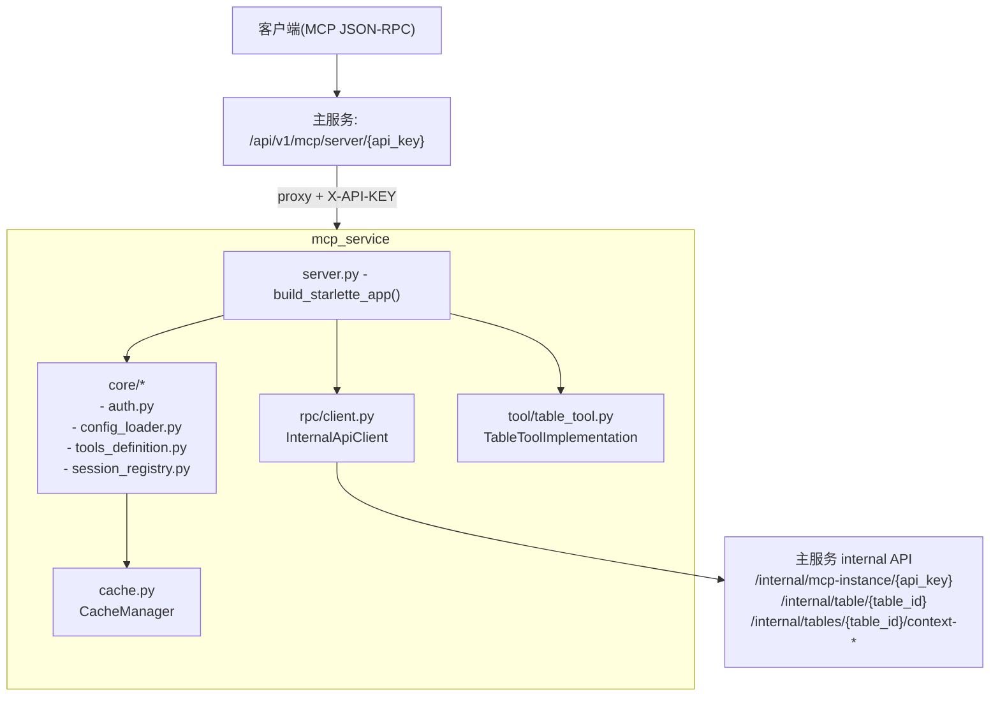

# PuppyOne Context MCP Server

一个基于MCP Python SDK的共享MCP Server服务，用于替代原有的多进程架构。

## Feature

- ✅ **单一服务多租户**：所有MCP实例共享一个服务，通过`X-API-KEY`实现隔离
- ✅ **动态工具配置**：支持运行时配置工具名称和描述
- ✅ **缓存优化**：使用cashews实现内存缓存，减少RPC调用
- ✅ **健康检查**：提供`/healthz`端点用于监控
- ✅ **工具通知**：支持工具列表变更通知（tools/list changed）

## Architecture

```
客户端请求
  └─> 主服务 (/api/v1/mcp/server/{api_key})
       └─> 添加 X-API-KEY header
            └─> 转发到 MCP Server (内网)
                 ├─> 提取 api_key
                 ├─> 查询缓存（如果命中）
                 ├─> RPC调用主服务 /internal (如果缓存未命中)
                 └─> 返回工具列表或调用结果
```

### Module/Responsibility Diagram (Current Implementation)



## 启动服务

```bash
# 推荐：与主服务一致的启动方式（uv run）
uv run uvicorn mcp_service.server:app --host 0.0.0.0 --port 3090 --reload --log-level info

# 兼容：使用 Python 模块入口（不推荐）
python -m mcp_service
```

## API端点

### MCP协议端点

- `POST /mcp` - MCP协议入口（支持SSE）

### 管理端点

- `GET /healthz` - 健康检查
  ```bash
  curl http://localhost:3090/healthz
  ```

- `POST /cache/invalidate` - 缓存失效通知
  ```bash
  curl -X POST http://localhost:3090/cache/invalidate \
    -H "Content-Type: application/json" \
    -d '{"api_key": "YOUR_API_KEY"}'
  ```

## 工具列表

MCP Server根据api_key动态返回工具列表：

### 基础工具

- `get_data_schema` - 获取挂载点数据结构（不包含实际值）
- `get_all_data` - 获取挂载点全部数据
- `query_data` - 对挂载点数据执行JMESPath查询
- `create_element` - 创建表格元素
- `update_element` - 更新表格元素
- `delete_element` - 删除表格元素

### LLM Retrieve工具（需要配置preview_keys）

- `preview_data` - 预览数据（轻量级）
- `select_data` - 选择数据（根据字段匹配）

## 测试

### 1. 测试健康检查

```bash
curl http://localhost:3090/healthz
```

### 2. 测试tools/list

```bash
curl -X POST http://localhost:8000/api/v1/mcp/server/YOUR_API_KEY \
  -H "Content-Type: application/json" \
  -d '{"jsonrpc": "2.0", "method": "tools/list", "id": 1}'
```

### 3. 测试tools/call

```bash
curl -X POST http://localhost:8000/api/v1/mcp/server/YOUR_API_KEY \
  -H "Content-Type: application/json" \
  -d '{
    "jsonrpc": "2.0",
    "method": "tools/call",
    "params": {
      "name": "get_all_data",
      "arguments": {}
    },
    "id": 2
  }'
```

## 缓存策略

- **缓存键**：`mcp:config:{api_key}`
- **缓存内容**：MCP实例配置 + 表格元数据
- **过期时间**：通过 `CACHE_TTL` 配置（默认15分钟）
- **失效机制**：主服务更新数据时主动通知

## 性能优化

1. **缓存层**：减少对主服务的RPC调用
2. **弱引用Session**：自动GC不活跃的连接
3. **异步处理**：所有I/O操作均为异步
4. **连接复用**：RPC客户端使用连接池

## 监控

### 查看缓存统计

```bash
curl http://localhost:3090/healthz
```

返回示例：

```json
{
  "status": "healthy",
  "service": "mcp-service",
  "cache": {
    "backend": "memory",
    "ttl": 900
  }
}
```

## 开发

### 项目结构

```
mcp_service/
├── __init__.py
├── __main__.py          # 兼容入口（python -m）
├── server.py            # Starlette app + MCP 协议实现（导出 app）
├── cache.py             # 缓存层
├── core/                # 核心支撑模块（入口无关）
│   ├── __init__.py
│   ├── auth.py          # api_key 提取/解析
│   ├── config_loader.py # load_mcp_config（cache + internal api）
│   ├── session_registry.py
│   └── tools_definition.py
├── event_store.py       # 事件存储
├── rpc/
│   ├── __init__.py
│   └── client.py        # RPC客户端
└── tool/
    ├── __init__.py
    └── table_tool.py    # 工具实现
```

### 添加新工具

1. 在 `core/tools_definition.py` 的 `tool_types` 中添加工具类型
2. 在 `core/tools_definition.py` 的 `ToolDefinitionProvider` 中添加默认名称和描述
3. 在 `core/tools_definition.py` 的 `build_tools_list` 中添加工具 schema
4. 在 `server.py` 的 `call_tool` 中添加工具调用逻辑
5. 在 `tool/table_tool.py` 中实现工具逻辑
