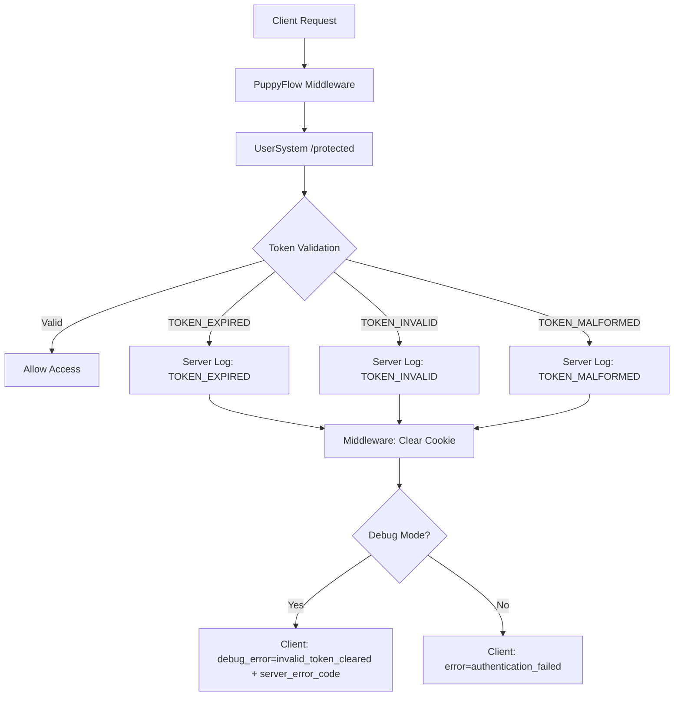

# Security Error Handling Strategy

## Overview

为了防止信息泄露和潜在的token碰撞破解攻击，我们采用了分层错误处理策略：
- **服务器端**：保持详细的错误类型和日志，便于调试和监控
- **客户端**：合并敏感错误类型为统一错误，避免泄露内部系统信息

## JWT Token Error Security Policy

### Server-Side Error Types (Internal)

在 `/protected` 端点中，我们维护详细的错误分类：

```typescript
// 服务器内部错误码（不暴露给客户端）
TOKEN_EXPIRED     // JWT已过期
TOKEN_INVALID     // JWT格式错误或签名无效  
TOKEN_MALFORMED   // JWT无法解码
TOKEN_MISSING     // 缺少认证token
AUTH_ERROR        // 其他认证错误
```

### Client-Side Error Types (Public)

通过PuppyFlow middleware，我们将敏感的token错误合并：

```typescript
// 客户端错误码（安全的公开信息）
authentication_failed    // 统一的认证失败错误（包含TOKEN_EXPIRED, TOKEN_INVALID, TOKEN_MALFORMED）
service_unavailable     // 服务不可用
service_configuration   // 配置问题
```

### Error Flow Architecture



### Security Benefits

1. **Information Hiding**: 客户端无法区分不同的token失败原因，降低攻击者获取系统内部信息的可能性

2. **Attack Surface Reduction**: 统一的错误响应减少了潜在的timing attack和error-based enumeration攻击面

3. **Debugging Capability**: 服务器端保持详细日志，开发团队仍可进行有效的问题诊断

4. **Consistent UX**: 用户看到统一的"认证失败"提示，避免技术细节干扰

### Implementation Details

#### PuppyFlow Middleware (middleware.ts)

```typescript
// 生产模式：统一错误类型
if (!debugMode) {
  userFriendlyUrl.searchParams.set('error', 'authentication_failed');
  userFriendlyUrl.searchParams.set('message', 'Authentication failed. Please sign in again.');
}

// 调试模式：提供技术详情
if (debugMode) {
  debugUrl.searchParams.set('debug_error', 'invalid_token_cleared');
  debugUrl.searchParams.set('server_error_code', errorCode); // 内部错误码
}
```

#### UserSystem Backend (auth_routes.py)

```python
# 保持详细的服务器端错误分类
if "ExpiredSignatureError" in error_type:
    return JSONResponse({
        "error_code": "TOKEN_EXPIRED",
        "message": "Token has expired",
        "detail": "Please login again to get a new token"
    }, status_code=401)
```

#### Client Error Display (login-client.tsx)

```typescript
// 统一的客户端错误处理
const friendlyMessages = {
  'authentication_failed': '🔐 Authentication Failed', // 包含所有token相关错误
  'service_unavailable': '🚫 Service Unavailable',
  'service_configuration': '⚙️ Service Configuration Issue'
};
```

## Debug Mode Security Controls

### Environment Variable Configuration

```bash
# 开发环境 (Development)
DEBUG_AUTH=true     # 服务器端调试开关

# 预发布环境 (Staging) 
DEBUG_AUTH=true     # 运营团队调试支持

# 生产环境 (Production)
DEBUG_AUTH=false    # 关闭调试信息传递
```

### 🔐 安全优势：服务器端控制

与之前的 `NEXT_PUBLIC_DEBUG_AUTH` 客户端控制相比，新的 `DEBUG_AUTH` 服务器端控制具有以下安全优势：

1. **隐藏调试机制**：客户端JavaScript代码中不包含任何调试开关的痕迹
2. **防止篡改**：用户无法通过修改环境变量来启用调试信息
3. **动态控制**：可以在运行时更改调试开关，无需重新构建客户端应用
4. **最小信息泄露**：只有在服务器明确启用时才向客户端传递调试信息

### 调试信息控制流程

1. **服务器端 (PuppyFlow Middleware)**：
   - 记录详细错误到服务器日志 (始终)
   - 检查 `DEBUG_AUTH` 环境变量
   - 仅当 `DEBUG_AUTH=true` 时才在URL中包含 `debug_error` 参数

2. **客户端 (PuppyAgentUserWeb)**：
   - 检测URL中是否存在 `debug_error` 参数
   - 若存在则自动在控制台显示技术信息
   - 生产环境下不传递调试参数，只显示用户友好错误信息

### Debug Mode Considerations

在调试环境中，我们仍然提供详细的技术信息：
- 通过 `server_error_code` 参数传递内部错误码
- 在浏览器控制台显示完整的错误上下文
- 保持服务器日志的详细性
- **重要**：调试信息的传递完全由服务器控制，客户端无法强制启用

### Monitoring and Logging

服务器端日志应包含：
```json
{
  "timestamp": "2024-01-15T10:30:00Z",
  "error_code": "TOKEN_EXPIRED",
  "user_agent": "...",
  "ip_address": "...",
  "token_prefix": "eyJhbGc...",
  "request_path": "/protected"
}
```

这种策略确保了安全性和可维护性的平衡。 