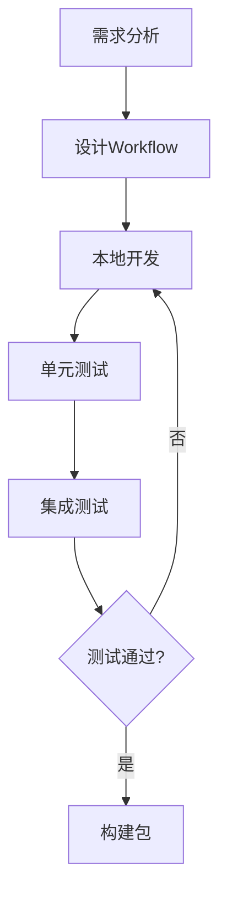
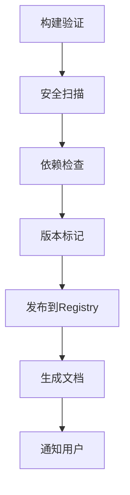
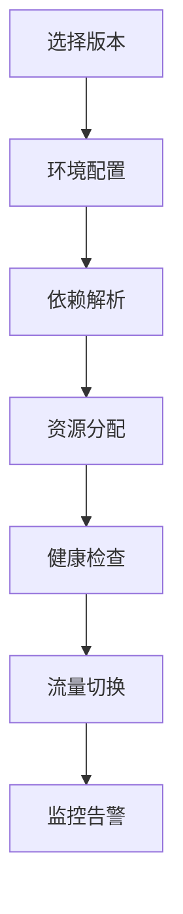

# Workflow as a Resource (WaaR) 架构设计文档

## 📋 文档信息

- **文档版本**: v1.0
- **创建日期**: 2024年
- **作者**: PuppyAI团队
- **目标**: 定义未来Workflow资源化架构的设计规范

## 🎯 概述

Workflow as a Resource (WaaR) 是一种将工作流程作为独立、可发布、可管理的资源单元的架构设计模式。它借鉴了容器化、微服务和云原生的设计理念，将Workflow从"数据"提升为"资源"。

## 🏗️ 架构演进

### 当前架构（应用中心）
```
用户编辑器 → JSON数据 → API传输 → 执行引擎
     ↓
  Workflow作为数据在系统中流转
```

### 目标架构（资源中心）
```
Workflow Registry ← 开发工具
     ↓
 独立资源包 → 部署引擎 → 执行环境
     ↓
 版本管理、依赖管理、生命周期管理
```

## 📦 核心概念

### 1. Workflow Resource 定义

```yaml
# workflow-resource.yaml
apiVersion: puppyai.com/v1
kind: Workflow
metadata:
  name: "sentiment-analysis"
  version: "1.2.0"
  author: "user@company.com"
  description: "Multi-language sentiment analysis workflow"
  tags: ["nlp", "sentiment", "analysis"]
  license: "MIT"
  created: "2024-01-15T10:30:00Z"
  updated: "2024-01-20T15:45:00Z"

spec:
  # 工作流定义
  blocks:
    - id: "input"
      type: "text"
      metadata:
        label: "文本输入"
        description: "待分析的文本内容"
      schema:
        type: "string"
        maxLength: 10000
    
    - id: "processor"
      type: "llm"
      metadata:
        label: "情感分析处理器"
        model: "gpt-4"
      config:
        temperature: 0.3
        max_tokens: 100
  
  edges:
    - id: "main-flow"
      source: "input"
      target: "processor"
      type: "llm"
      config:
        prompt: "分析以下文本的情感倾向：{{input}}"
  
  # 运行时配置
  runtime:
    requirements:
      compute: "standard"
      memory: "2Gi"
      storage: "10Gi"
      timeout: "5m"
    
    dependencies:
      external_apis:
        - name: "openai"
          version: "^1.0"
          required: true
        - name: "pinecone"
          version: "~2.1.0"
          required: false
      
      workflows:
        - name: "text-preprocessor"
          version: "^1.5.0"
          registry: "public"
    
    environments:
      development:
        llm_model: "gpt-3.5-turbo"
        max_tokens: 1000
        debug: true
      
      production:
        llm_model: "gpt-4"
        max_tokens: 2000
        debug: false
        monitoring: true

  # 接口定义
  interface:
    inputs:
      - name: "text"
        type: "string"
        required: true
        description: "输入文本"
      - name: "language"
        type: "string"
        default: "auto"
        enum: ["auto", "zh", "en", "ja"]
    
    outputs:
      - name: "sentiment"
        type: "object"
        schema:
          properties:
            score: { type: "number", min: -1, max: 1 }
            label: { type: "string", enum: ["positive", "negative", "neutral"] }
            confidence: { type: "number", min: 0, max: 1 }

  # 测试用例
  tests:
    - name: "positive-sentiment"
      inputs:
        text: "今天天气真好，心情很棒！"
        language: "zh"
      expected:
        sentiment:
          label: "positive"
          score: 0.8
    
    - name: "negative-sentiment"
      inputs:
        text: "This is terrible and disappointing"
        language: "en"
      expected:
        sentiment:
          label: "negative"
          score: -0.7

# 权限和安全
security:
  access_control:
    read: ["public"]
    execute: ["authenticated"]
    modify: ["owner", "collaborator"]
  
  data_privacy:
    pii_handling: "strip"
    data_retention: "30d"
    encryption: "aes-256"
```

### 2. Registry API 规范

```yaml
# Workflow Registry API v1
openapi: 3.0.0
info:
  title: Workflow Registry API
  version: 1.0.0

paths:
  /workflows:
    get:
      summary: 列出所有工作流
      parameters:
        - name: category
          in: query
          schema: { type: string }
        - name: author
          in: query
          schema: { type: string }
        - name: tag
          in: query
          schema: { type: array }
      responses:
        200:
          content:
            application/json:
              schema:
                type: object
                properties:
                  workflows:
                    type: array
                    items: { $ref: '#/components/schemas/WorkflowSummary' }
                  pagination:
                    $ref: '#/components/schemas/Pagination'
    
    post:
      summary: 发布新工作流
      requestBody:
        content:
          multipart/form-data:
            schema:
              properties:
                manifest: { type: string, format: yaml }
                package: { type: string, format: binary }
      responses:
        201:
          content:
            application/json:
              schema:
                $ref: '#/components/schemas/WorkflowResource'

  /workflows/{name}:
    get:
      summary: 获取特定工作流
      parameters:
        - name: name
          in: path
          required: true
          schema: { type: string }
        - name: version
          in: query
          schema: { type: string }
      responses:
        200:
          content:
            application/json:
              schema:
                $ref: '#/components/schemas/WorkflowResource'
    
    put:
      summary: 更新工作流
      security:
        - bearerAuth: []
      responses:
        200:
          description: 更新成功
    
    delete:
      summary: 删除工作流
      security:
        - bearerAuth: []
      responses:
        204:
          description: 删除成功

  /workflows/{name}/versions:
    get:
      summary: 获取工作流版本历史
      responses:
        200:
          content:
            application/json:
              schema:
                type: array
                items: { $ref: '#/components/schemas/VersionInfo' }

  /workflows/{name}/deploy:
    post:
      summary: 部署工作流
      requestBody:
        content:
          application/json:
            schema:
              properties:
                version: { type: string }
                environment: { type: string }
                config: { type: object }
      responses:
        202:
          content:
            application/json:
              schema:
                properties:
                  deployment_id: { type: string }
                  status: { type: string }

components:
  schemas:
    WorkflowSummary:
      type: object
      properties:
        name: { type: string }
        version: { type: string }
        author: { type: string }
        description: { type: string }
        tags: { type: array, items: { type: string } }
        downloads: { type: integer }
        rating: { type: number }
        updated: { type: string, format: date-time }
    
    WorkflowResource:
      type: object
      properties:
        metadata: { $ref: '#/components/schemas/Metadata' }
        spec: { $ref: '#/components/schemas/WorkflowSpec' }
        status: { $ref: '#/components/schemas/WorkflowStatus' }
```

## 🛠️ 技术实现

### 1. CLI 工具链

```bash
# 安装 CLI 工具
npm install -g @puppyai/workflow-cli

# 初始化新工作流项目
puppy-cli init my-workflow
cd my-workflow

# 开发模式（本地测试）
puppy-cli dev --watch

# 构建工作流包
puppy-cli build
# 输出: my-workflow-1.0.0.wfpkg

# 验证工作流
puppy-cli validate
puppy-cli test

# 发布到 Registry
puppy-cli login
puppy-cli publish

# 部署工作流
puppy-cli deploy my-workflow:1.0.0 --env production

# 管理工作流
puppy-cli list
puppy-cli info my-workflow
puppy-cli logs my-workflow --env production
```

### 2. SDK 开发套件

```python
# Python SDK
from puppyai.workflows import WorkflowClient, WorkflowBuilder

# 客户端
client = WorkflowClient(
    registry_url="https://registry.puppyai.com",
    auth_token="your-token"
)

# 下载并执行工作流
workflow = client.get_workflow("sentiment-analysis", version="1.2.0")
result = workflow.execute(
    inputs={"text": "Hello World"},
    environment="production"
)

# 编程式构建工作流
builder = WorkflowBuilder()
builder.add_block("input", type="text")
builder.add_block("llm", type="llm", config={"model": "gpt-4"})
builder.add_edge("input", "llm")

workflow = builder.build()
client.publish(workflow)
```

```javascript
// JavaScript SDK
import { WorkflowClient, WorkflowBuilder } from '@puppyai/workflow-sdk';

const client = new WorkflowClient({
  registryUrl: 'https://registry.puppyai.com',
  authToken: 'your-token'
});

// 异步执行工作流
const result = await client.execute('sentiment-analysis:1.2.0', {
  text: 'Hello World',
  language: 'en'
});

console.log(result.sentiment);
```

### 3. 存储与版本管理

```yaml
# 存储架构
Registry Storage:
  ├── workflows/
  │   ├── sentiment-analysis/
  │   │   ├── 1.0.0/
  │   │   │   ├── manifest.yaml
  │   │   │   ├── workflow.json
  │   │   │   ├── tests/
  │   │   │   └── docs/
  │   │   ├── 1.1.0/
  │   │   └── 1.2.0/
  │   └── text-processor/
  ├── indexes/
  │   ├── by-category.json
  │   ├── by-author.json
  │   └── by-tags.json
  └── metadata/
      ├── downloads.json
      ├── ratings.json
      └── dependencies.json
```

## 🔄 开发工作流程

### 1. 开发阶段


### 2. 发布阶段


### 3. 部署阶段


## 📊 监控与运维

### 1. 资源监控
```yaml
metrics:
  - name: "workflow_executions_total"
    type: "counter"
    labels: ["workflow_name", "version", "status"]
  
  - name: "workflow_execution_duration"
    type: "histogram"
    labels: ["workflow_name", "version"]
  
  - name: "workflow_resource_usage"
    type: "gauge"
    labels: ["workflow_name", "resource_type"]

alerts:
  - name: "high_error_rate"
    expr: "rate(workflow_executions_total{status='error'}[5m]) > 0.1"
    severity: "warning"
  
  - name: "workflow_down"
    expr: "up{job='workflow'} == 0"
    severity: "critical"
```

### 2. 日志规范
```json
{
  "timestamp": "2024-01-20T15:30:00Z",
  "level": "INFO",
  "workflow": {
    "name": "sentiment-analysis",
    "version": "1.2.0",
    "execution_id": "exec-12345"
  },
  "event": "execution_started",
  "metadata": {
    "user_id": "user-789",
    "environment": "production",
    "inputs": {
      "text": "[REDACTED]",
      "language": "en"
    }
  }
}
```

## 🚀 实施路线图

### 阶段1：基础设施建设（3个月）
- [ ] Registry服务架构设计
- [ ] 基础API开发
- [ ] CLI工具原型
- [ ] 存储方案实现

### 阶段2：核心功能开发（4个月）
- [ ] 版本管理系统
- [ ] 依赖解析引擎
- [ ] 部署引擎开发
- [ ] 监控系统集成

### 阶段3：开发者体验优化（3个月）
- [ ] SDK开发（Python/JavaScript/Go）
- [ ] 文档和教程
- [ ] 工作流模板库
- [ ] 社区工具集成

### 阶段4：企业级特性（4个月）
- [ ] 私有Registry部署
- [ ] 权限管理系统
- [ ] 企业级监控
- [ ] SLA保证

### 阶段5：生态系统建设（持续）
- [ ] Marketplace开发
- [ ] 第三方集成
- [ ] 认证合作伙伴
- [ ] 开源社区建设

## 💼 商业模式

### 1. 免费层级
- 公开Registry使用
- 基础CLI工具
- 社区支持
- 限制：100次/月执行

### 2. 专业版
- 私有Workflow支持
- 高级监控功能
- 邮件支持
- 限制：10,000次/月执行

### 3. 企业版
- 私有Registry部署
- 企业级安全
- 专业技术支持
- 无执行次数限制

### 4. Marketplace
- 付费Workflow销售
- 开发者分成机制
- 认证Workflow标识
- 企业定制服务

## 🔒 安全与合规

### 1. 安全措施
```yaml
security_framework:
  authentication:
    - multi_factor_auth
    - api_key_management
    - token_rotation
  
  authorization:
    - role_based_access
    - resource_permissions
    - audit_logging
  
  data_protection:
    - encryption_at_rest
    - encryption_in_transit
    - pii_detection
  
  vulnerability_management:
    - dependency_scanning
    - container_scanning
    - code_analysis
```

### 2. 合规要求
- GDPR数据保护
- SOC2 Type II认证
- ISO 27001信息安全
- HIPAA医疗数据保护

## 📚 技术债务管理

### 当前技术债务
1. **认证系统不统一**
   - 解决方案：标准化JWT认证
   - 优先级：高
   - 预计工期：2周

2. **API接口不一致**
   - 解决方案：OpenAPI规范化
   - 优先级：中
   - 预计工期：4周

3. **监控覆盖不完整**
   - 解决方案：全链路监控
   - 优先级：中
   - 预计工期：6周

### 重构策略
- 采用渐进式重构，避免大规模改写
- 新功能优先使用新架构
- 老功能逐步迁移
- 保持向后兼容性

## 📈 成功指标

### 技术指标
- Registry可用性 > 99.9%
- 平均部署时间 < 30秒
- 工作流执行成功率 > 95%
- API响应时间 < 200ms

### 业务指标
- 注册开发者数量
- 工作流发布数量
- 月活跃用户数
- 企业客户转化率

### 生态指标
- 社区贡献数量
- 第三方集成数量
- 开源项目引用数
- 技术文章和教程数

## 🤝 结论

Workflow as a Resource 架构将为PuppyAI生态系统带来：

1. **开发效率提升**：标准化开发流程，提高复用性
2. **运维成本降低**：自动化部署和监控
3. **生态系统扩展**：支持第三方开发者和企业用户
4. **商业价值创造**：多元化收入模式

这是一个长期且系统性的架构升级，需要团队在技术、产品和商业层面的协同努力。通过渐进式实施，我们可以在保持现有系统稳定的同时，逐步构建起强大的Workflow生态系统。

---

**文档状态**: 📝 设计阶段  
**下次审核**: 待定  
**相关文档**: [当前架构文档] | [技术规范] | [开发指南] 